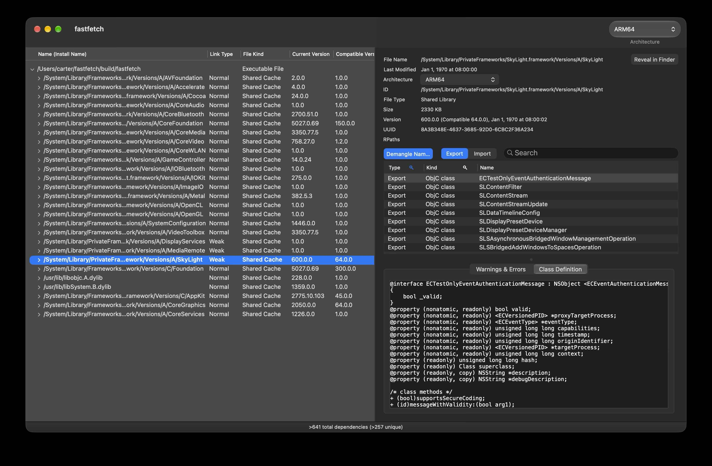

MacDependency shows all dependent libraries and frameworks of a given executable, dynamic library or framework on Mac OS X. It is a GUI replacement for the otool command, and provides almost the same functionality as the Dependency Walker (<http://www.dependencywalker.com>) on Windows.

More information available in the [Wiki](../../wiki).



## This fork

This repository is a fork of [kwin/macdependency](https://github.com/kwin/macdependency).  
It keeps everything the original does and adds:

- the Objective-C metadata of an image, printed as a declaration;
- the system libraries that exist only in the **dyld shared cache**;
- a **Kind** column in the symbol table, with filters on the headers of the  
  Type and Kind columns;
- a **File Kind** column in the dependency tree, next to the renamed **Link Type** column;
- a log that is readable in dark mode and read-only.

Below, **this fork** marks a feature that only exists here.

## What it does

- Opens an executable, a dynamic library or a framework and shows everything it  
  depends on as a tree, with the install name, how the dependency is linked, what  
  the file itself is, and the current and compatible version of every entry.
- For the selected entry it shows what the load command behind it says: file name,  
  file type, ID, size, UUID, architecture, last modified date, RPaths and the dynamic  
  linker it was linked against. *Reveal in Finder* jumps to the file.
- Reports what is wrong with the link — dependencies that cannot be found, version  
  mismatches, name mismatches, architecture mismatches — in the *Warnings & Errors*  
  tab, where every line links to the dependency it concerns.
- Switches between the architectures of a universal binary.
- Searches the symbol table by name, and narrows it down to one type or one kind  
  of symbol.

On top of that, MacDependency takes the Objective-C metadata and the symbol table of  
an image apart, which is what the rest of this document is about.

## The dependency tree

| Name (Install Name) | Link Type | File Kind       | Current Version | Compatible Version |
| ------------------- | --------- | --------------- | --------------- | ------------------ |
| DVTFoundation       | Normal    | Dynamic Library | 1.0.0           | 1.0.0              |
| Foundation          | Normal    | Shared Cache    | 2000.0.0        | 150.0.0            |
| LoggingSupport      | Weak      | Shared Cache    | 1.0.0           | 1.0.0              |

- **Link Type** — how the dependency is linked, i.e. which of the load commands  
  brought it in: `Normal` (`LC_LOAD_DYLIB`), `Weak` (`LC_LOAD_WEAK_DYLIB`, the  
  dependency is allowed to be missing) or `Delayed` (`LC_LAZY_LOAD_DYLIB`).  
  *This fork:* the column used to be called simply *Type*, which said nothing  
  about what it was a type of, now that a second column describes the file.
- **File Kind** — what the file itself is. *This fork.*
  - `Executable File` — `MH_EXECUTE`;
  - `Dynamic Library` — `MH_DYLIB`, and the other things that are loaded into  
    another process: bundles, stubs, kext bundles, the dynamic linker;
  - `Shared Cache` — the image has no file on disk at all, it was read out of the  
    dyld shared cache (see below);
  - `Unknown` — nothing was read for the row, because the library is missing or  
    has no architecture in common with its parent.
- The **Name** column is the one that takes up the slack when the list is resized;  
  the four columns after it keep the width they were given.
- A row is drawn in the ordinary text colour, in red when the dependency could not  
  be resolved and in yellow when it is only a warning.

## Objective-C class definitions

*This fork.* MacDependency reads the Objective-C metadata out of the Mach-O image  
itself and prints it as a declaration, so a symbol like `_OBJC_CLASS_$_NSView` can  
be turned back into the interface it came from:

```objc
@interface NSView : NSResponder <NSAppearanceCustomizationInternal, NSISVariableDelegate,
                                 NSLayoutItem, NSISEngineDelegate, NSAnimatablePropertyContainer,
                                 NSUserInterfaceItemIdentification, NSDraggingDestination,
                                 NSAppearanceCustomization, NSAccessibilityElement, NSAccessibility>
{
    _NSTrackingAreaViewHelper *_trackingAreaHelper;
    NSPSMatrix *_frameMatrix;
    NSView *_superview;
    NSMutableSet *_dragTypes;
    CGRect _frame;
    CGRect _bounds;
    NSArray *_subviews;
    CALayer *_layer;
    NSWindow *_window;
    ...
}

+ (id)new;
+ (bool)requiresConstraintBasedLayout;
- (id)initWithFrame:(CGRect arg1);
@end
```

- **A single click** on a class symbol in the symbol table shows the declaration in  
  the *Class Definition* tab at the bottom of the window, without switching that tab  
  under you. **A double click** opens the same text in a window of its own:  
  monospaced, read-only, selectable, with a *Copy* button.
- Selecting the **metaclass** symbol (`_OBJC_METACLASS_$_NSView`) shows the class  
  methods of the class instead of its instance members.
- Selecting a symbol that is **not** a class says so rather than doing nothing:  
  *"Unsupported symbol: \_DVTAllocateObject is not an Objective-C class."* When the  
  class cannot be found in the image, that is reported as well.
- The declaration is complete: the superclass, the protocols the class adopts, the  
  ivars with their types, the `@property` declarations with their attributes, and  
  both the instance and the class methods.
- A property of the protocol object itself — a class property — is printed with the  
  modern spelling: `@property (class, readonly) bool supportsSecureCoding;`, as in  
  `@protocol NSSecureCoding`.
- Nothing is loaded and no code is run to produce this — the metadata is parsed from  
  the image. For a system framework that means from the **dyld shared cache**, see below.
- The reader covers the whole of an image's Objective-C metadata, categories and  
  protocols included (`@interface NSArray (DVTFoundationAdditions)`, standalone  
  `@protocol ... @end`). The output has been compared entry by entry with  
  [`ipsw class-dump`](https://github.com/blacktop/ipsw): for AppKit the two agree on  
  all 2729 classes and all 66955 methods, and on the name of every category and  
  protocol.

## dyld shared cache

Since macOS 11 most system libraries and frameworks no longer exist as files on  
disk — they live in the dyld shared cache. MacDependency opens them anyway: it  
locates the image inside the shared cache and reads it from the memory the cache is  
mapped into. Such a dependency has no file to reveal in the Finder, which is what  
the **File Kind** column says with `Shared Cache`. *This fork:* the tree used to  
tell those rows apart by colouring them, which read badly; the column says it in  
words instead, in a colour that can be read.

## The symbol table

The symbol table lists the exported and the imported symbols of the selected image.  
It has three columns — Type, Kind and Name — and two filters, one on the type of a  
symbol and one on its kind:

| Type   | Kind       | Name                                                                       |
| ------ | ---------- | -------------------------------------------------------------------------- |
| Export | ObjC class | `DVTFilePath`                                                              |
| Export | ObjC ivar  | `DVTByteBuffer._bytes`                                                     |
| Export | C++        | `DVT::DVTArrayBuilder::_ensureCapacity(unsigned long)`                     |
| Export | Swift      | `static DVTFoundation.IconOfFileIconReference.== infix(...) -> Swift.Bool` |
| Export | C          | `DVTAllocateObject`                                                        |

- **Kind** *This fork.* Says what a symbol is: `C`, `C++`, `Swift`, `ObjC class`,  
  `ObjC metaclass`, `ObjC protocol`, `ObjC ivar` or `ObjC`. A symbol table records  
  no language, so the kind is worked out from the name — from the prefixes of the  
  two manglings and of the Objective-C metadata.
- **The filters sit in the headers of the columns they filter.** *This fork.* The  
  header of the Type column and the header of the Kind column each carry a chevron;  
  clicking it opens the list of what can be chosen. The column shows what the filter  
  is about, and a row that is missing is one the column would have shown. A chevron  
  is drawn in the accent colour while its filter is narrowing the table, so that  
  rows which are hidden do not look like rows that were never there.
- **The Type filter** offers `All types`, `Export` and `Import`, one of them at a  
  time. The same filter is also on the **Export** and **Import** buttons above the  
  table, which is where it is reached from most of the time; whichever of the two is  
  used, the other follows. The table opens on the exports alone. Turning off the  
  last type left on is refused, because a table with nothing in it says less than one  
  that still shows something.
- **The Kind filter** offers `All Kinds` followed by every kind of symbol, and the  
  list is built from the kinds the model knows about, so it cannot fall out of step  
  with what the Kind column can show.
- **Demangle Names** turns mangled names back into what they were written as: C++  
  names go through the Itanium demangler, Swift names through `swift_demangle`, and  
  the leading underscore of the C naming convention is dropped in every case.  
  Objective-C metadata symbols lose their prefix as well, so `_OBJC_CLASS_$_DVTFilePath`  
  reads `DVTFilePath`. With the option off, every name is shown exactly as the symbol  
  table holds it.
- **A double click on an imported symbol** follows it to the library that provides  
  it: the dependency tree selects that library, and its symbol table selects the  
  export of the same name. The type filter switches to *Export* on the way, because  
  the imports of the library that was jumped to are not what you are looking for.

## Copying

- **⌘C** copies the selected row of the symbol table exactly as the table displays  
  it, for instance `Export ObjC class DVTFilePath`. It acts only while the symbol  
  table has the focus and one of its rows is selected, so it stays out of the way  
  while the dependency tree is being used.
- The class definition text and the log are read-only but selectable, and ⌘C copies  
  the selection out of them as usual.

## The log


The *Warnings & Errors* tab collects what went wrong while the file was being read:  
dependencies that could not be found, version mismatches, architecture mismatches,  
and the reasons a class definition could not be produced. Lines that concern a  
particular dependency are links — clicking one jumps to it in the dependency tree.  
The text follows the system appearance and is readable in dark mode as well.  
*This fork:* it used to be drawn in black whatever the background, and to accept  
edits; it now carries a colour of its own and is read-only.
